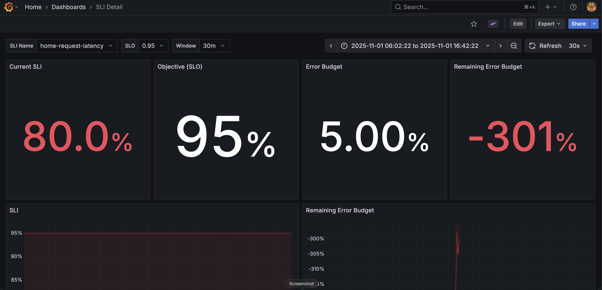

# FastAPI, Prometheus & Grafana Monitoring Project

This project is a complete, self-contained example of how to monitor a Python FastAPI application using Prometheus for metrics collection and Grafana for visualization. It also includes a simple shell-based load generator to create traffic, allowing you to see your dashboards light up with real-time data.

Beyond just basic metrics, this project also demonstrates how to implement professional-grade monitoring by defining and tracking Service Level Objectives (SLOs) and Service Level Indicators (SLIs). Using Prometheus Recording Rules, we pre-calculate our service's availability and latency to track our Error Budget in real-time, which is all visualized in a dedicated Grafana dashboard.


## Understanding SLOs, SLIs, and Error Budgets

In the previous section we talked about adding basic instrumentation which can be useful to keep on server metrics such as latency and error rate. But bare metrics are somewhat hard to reason about when creating service level agreements. For example, if we say we have an SLA that latency should be under 300ms, would that mean that 100% of all requests should have latencies under 300ms? It's an unreasonable expectation and quite hard to track.

SLOs are used to define service objectives in a more realistic and easy to reason about way. For example, if we define an SLO that 90% of all requests should have latency less than 300ms, it's not only a more reasonable expectation, it also reduces the whole monitoring to a single number that's easy to track and reason about.

SLOs also allow us to define error budgets which indicate how unreliable a service is allowed to be. This is great for removing the politics from negotiations between the SREs and the product developers when deciding how much risk to allow.

### Definitions

We will use the following definitions:
1. **SLO**: It's short for Service Level Objective and it defines the goal a service needs achieve.
2. **SLI**: Its short for Service Level Indicator and it shows how well the service is doing when it comes to achieving its set SLO. This is calculated as `number_of_good_events / total_number_of_events`.
3. **Error Budget**: Defines how unreliable a service is allowed to be. You can think of this like how much slack is allowed when it comes to meeting the set SLO. It's calculated as `1 - SLO`.
4. **Remaining Error Budget**: Defines how close a service is when it comes to consuming its set Error Budget. It's calculated as `1 - ((1 - SLI) / (1 - SLO))`.
5. **Compliance Window**: Defines the time frame over which the SLO is calculated which is intended to enforce recency.

### SLO Example

Let's take the following example in order to better illustrate the idea. Let's assume we have an SLO that says: "Service time should be at least 99%", so:
- **SLO** = 99%
- **Error Budget** = 1 - SLO = 100 - 99 = 1%

Let's assume that the current SLI is around 95% which means that the service uptime is 95% which also means that the number of good events (service is working fine) divided by the total number of events (all requests being handled by the service) is 95%.

This automatically means that we are in violation of our SLO. The **Remaining Error Budget** can be calculated as follows:
- `1 - SLI` to see how far are we from a perfect 100% uptime. In this case it's `1 - 0.95 = 0.05`
- `1 - SLO` also know as the **Error Budget** which is `0.01` in this case.
- `(1 - SLI) / (1 - SLO)` to see how bad did we do compared to a perfect 100% uptime, in this case we are 5 (`0.05 / 0.01`) times as far from perfect.
- `1 - ((1 - SLI) / (1 - SLO))` to see how far are we from the allowed error budget, in this case we are 4 times (`-400%`) as far (it's allowed to be far by 1% and we are far by 5% from the perfect 100%).




## Getting Started

## Requirements

- Python 3.13 or later

### Install Python using MiniConda

1. Download and install MiniConda from [here](https://docs.anaconda.com/free/miniconda/#quick-command-line-install)
2. Create a new environment:
   ```bash
   conda create -n mini-rag python=3.8
3) Activate the environment:
    ```bash
    $ conda activate mini-rag
   
## Installation

### Install the required packages

```bash
$ pip install -r requirements.txt
```
You only need to have `docker` and `docker-compose` installed on your machine. And then you can simply run:
```
docker-compose up server
```
to run the project and `docker-compose` will take care of the rest.

To view Grafana, head to `localhost:3000`, the username is `admin` and the password is `grafana`. If you wish to interface directly with Prometheus, go to `localhost:9090`. And the server is exposed over `localhost:8080`. You can find all these details [here](docker-compose.yml).


## Run the FastAPI server

```bash
$ uvicorn main:app --reload --host 0.0.0.0 --port 5020
```